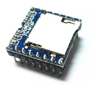

# Vorlage
## Inhaltsverzeichnis
1. [x] [Inhaltsverzeichnis](#Inhaltsverzeichnis)
1. [ ] [Beschreibung](#Beschreibung)
1. [ ] [Hardware](#Hardware)
   1. [ ] [Technische Daten](#technische-daten)
   1. [ ] [Datasheet](#datasheet)
   1. [ ] [PCB](#PCB)
1. [ ] [Software](#Software)
1. [ ] [3D](#3D)
1. [ ] [Where to buy](#Where-to-buy)
1. [ ] [Abbildungen](#Abbildungen)
1. [x] [Credits](#Credits)

## Beschreibung
The DFPlayer Mini MP3 Player For Arduino is a small and low price MP3 module with an simplified output directly to the speaker. The module can be used as a stand alone module with attached battery, speaker and push buttons or used in combination with an Arduino UNO or any other with RX/TX capabilities.

## Hardware
### Technische Daten
* supported sampling rates (kHz): 8/11.025/12/16/22.05/24/32/44.1/48
* 24 -bit DAC output, support for dynamic range 90dB , SNR support 85dB
* fully supports FAT16 , FAT32 file system, maximum support 32G of the TF card, support 32G of U disk, 64M bytes NORFLASH
* a variety of control modes, I/O control mode, serial mode, AD button control mode
* advertising sound waiting function, the music can be suspended. when advertising is over in the music continue to play
* audio data sorted by folder, supports up to 100 folders, every folder can hold up to 255 songs
* 30 level adjustable volume, 6 -level EQ adjustable

### Datasheet
* [DFPlayer_FN-M16P](https://github.com/DFRobot/DFRobotDFPlayerMini/blob/master/doc/FN-M16P%2BEmbedded%2BMP3%2BAudio%2BModule%2BDatasheet.pdf)
* [snapshot](datasheet/FN-M16P_DFPlayer_Mini.pdf)
### PCB
## Software
## 3D

## Where to buy
~ 6 EUR for 10pcs: [AliExpress](https://www.aliexpress.com/item/32821800330.html)

## Abbildungen

## Credits
* :+1: [DFRobot](https://www.dfrobot.com/product-1121.html)
* :+1: [arduino](https://github.com/arduino)
* :+1: [adafruit](https://github.com/adafruit)
* :+1: [sparkfun](https://github.com/sparkfun)
* :+1: [Watterott](https://github.com/watterott) and @awatterott for great SW, HW and products
* :+1: [atom](https://github.com/atom)
* :+1: [mattahan](https://www.deviantart.com/mattahan) for the [Buuf graphics](https://www.deviantart.com/mattahan/art/Buuf-37966044)
* :+1: @ikatyang for the [emoji-cheat-sheet](https://github.com/ikatyang/emoji-cheat-sheet/blob/master/README.md)
